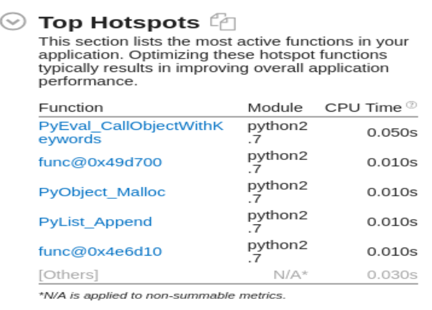

# Comparing model performance

## Model research

In this I have used  Intel® OpenVINO's [Pedestrian Detection Model](https://docs.openvinotoolkit.org/latest/_models_intel_person_detection_retail_0013_description_person_detection_retail_0013.html). The legal model name is "person-detection-retail-0013". 

### To Download the model, I used the following command
```sh
  cd /opt/intel/openvino/development_tool/tools/model_downloader/
  sudo ./downloader.py --name person-detection-retail-0013
```

## TensorFlow Object Detection Model Zoo

TensorFlow Object Detection Model Zoo (https://github.com/tensorflow/models/blob/master/research/object_detection/g3doc/detection_model_zoo.md) contains many pre-trained models on the coco dataset. Ssd_inception_v2_coco and faster_rcnn_inception_v2_coco performed good as compared to rest of the models, but, in this project, faster_rcnn_inception_v2_coco is used which is fast in detecting people with less errors. Intel openVINO already contains extensions for custom layers used in TensorFlow Object Detection Model Zoo.

## Before choosing Intel® OpenVINO's pre-trained model, i tried the following models. 

### 1. SSD Mobilenet V1 COCO

The reason of not using this model is that it leaves a lot of frames while detecting, although the size of model is not that large.

Downloading the model from the GitHub repository of Tensorflow Object Detection Model Zoo by the following command:

```
wget http://download.tensorflow.org/models/object_detection/ssd_mobilenet_v1_coco_2018_01_28.tar.gz
```
Extracting the tar.gz file by the following command:

```
tar -xvf ssd_mobilenet_v1_coco_2018_01_28.tar.gz
```
Changing the directory to the extracted folder of the downloaded model:

```
cd ssd_mobilenet_v1_coco_2018_01_28
```
Converting the TensorFlow model to Intermediate Representation (IR) or OpenVINO IR format. The command used is given below:

```
python /opt/intel/openvino/deployment_tools/model_optimizer/mo.py --input_model ssd_mobilenet_v1_coco_2018_01_28/frozen_inference_graph.pb --tensorflow_object_detection_api_pipeline_config pipeline.config --reverse_input_channels --tensorflow_use_custom_operations_config /opt/intel/openvino/deployment_tools/model_optimizer/extensions/front/tf/ssd_support.json
```

### 2. SSD Mobilenet V2 COCO

This version of SSD model improved, as it detected greater frames than SSD V1, but then also a lot of valid frame were not detected, and also its size is also that huge, hence it can be used on edge devices.

Downloading the model from the GitHub repository of Tensorflow Object Detection Model Zoo by the following command:

```
wget http://download.tensorflow.org/models/object_detection/ssd_mobilenet_v2_coco_2018_03_29.tar.gz
```
Extracting the tar.gz file by the following command:

```
tar -xvf ssd_mobilenet_v2_coco_2018_03_29.tar.gz
```
Changing the directory to the extracted folder of the downloaded model:

```
cd ssd_mobilenet_v2_coco_2018_03_29
```
Converting the TensorFlow model to Intermediate Representation (IR) or OpenVINO IR format. The command used is given below:

```
python /opt/intel/openvino/deployment_tools/model_optimizer/mo.py --input_model ssd_mobilenet_v2_coco_2018_03_29/frozen_inference_graph.pb --tensorflow_object_detection_api_pipeline_config pipeline.config --reverse_input_channels --tensorflow_use_custom_operations_config /opt/intel/openvino/deployment_tools/model_optimizer/extensions/front/tf/ssd_v2_support.json
```

### 3. Faster RCNN Inception V2 COCO

The reason of not using this model is that although it was able to improve on both the ealier models, but the size of this model big, so it made my application slow, and also not every edge device will be able to run a big model.

Downloading the model from the GitHub repository of Tensorflow Object Detection Model Zoo by the following command:

```
wget http://download.tensorflow.org/models/object_detection/faster_rcnn_inception_v2_coco_2018_01_28.tar.gz
```
Extracting the tar.gz file by the following command:

```
tar -xvf faster_rcnn_inception_v2_coco_2018_01_28.tar.gz
```
Changing the directory to the extracted folder of the downloaded model:

```
cd faster_rcnn_inception_v2_coco_2018_01_28
```
Converting the TensorFlow model to Intermediate Representation (IR) or OpenVINO IR format. The command used is given below:

```
python /opt/intel/openvino/deployment_tools/model_optimizer/mo.py --input_model faster_rcnn_inception_v2_coco_2018_01_28/frozen_inference_graph.pb --tensorflow_object_detection_api_pipeline_config pipeline.config --reverse_input_channels --tensorflow_use_custom_operations_config /opt/intel/openvino/deployment_tools/model_optimizer/extensions/front/tf/faster_rcnn_support.json
```

# Explaining Custom Layers

Custom layers handling is very important as the device that we would be using will not be able to process each and every layer.

CPU processed almost all custom layers, but that is not the case in terms of GPU, TPU or VPU.


# Assess Model Use Cases

I think this app can find its usage in Retail Scenarios, Manufacturing Scenarios and Transport Scenarios as discussed in the project "Smart Queueing System".

Other used could be that i can be used to count the number of people crossing a given point. 

Or how many people are visiting a particular counter in a mall

# Assess Effects on End User Needs

Lighting, model accuracy, and camera focal length/image size have different effects on a deployed edge model. The potential effects of each of these are as follows...
1. Lighting can cause the model to miss a person.
2. Low Model accuracy will cause make a model either mis-classify or even to miss detecting a person.
3. Camera lengh/image size, can highly affect having a very large frame/image size will cause the model to get struct a point, or may cause the application to close.
4. Another is camera angle, it is important as if camera is not adjusted properly, it may be possible that bounding boxes could not be drawn properly.

## Model Comparison

| Model Name                    |   Speed (ms)  | 	COCO mAP[^1] | Size (MB) |
|-------------------------------|---------------|----------------|-----------|
| ssd_mobilenet_v1_coco         |     30        |       21       |    86     |
| ssd_mobilenet_v2_coco         |     31        |       22       |   201     |
| faster_rcnn_inception_v2_coco |     58        |       28       |   167     |


## App Stats

The following statstics has been obtained through the use of Intel Vtune Profiler.

I have added the Vtune project, for you to view the stats.

### Elapsed Time


### Effective CPU Utilization


### Top Hotspots

